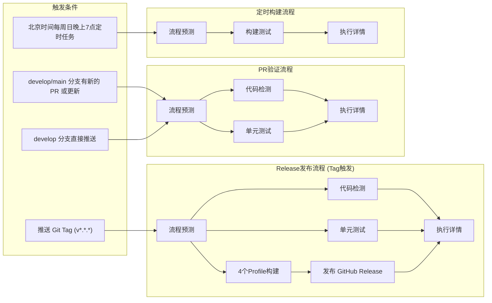

<!--
 * // -----------------------------------------------------------------------------
 * //  Copyright (c) 2025 Vanishing Games. All Rights Reserved.
 * @Author: VanishXiao
 * @Date: 2025-08-16 14:39:46
 * @LastEditTime: 2026-04-12 12:00:00
 * // -----------------------------------------------------------------------------
-->
# Actions

## CI

### 单元测试

运行 Unity 项目中的单元测试（EditMode 和 PlayMode）。

如有未通过的测试，则终止流水线。

### 构建测试

构建项目的 4 个 Build Profile 版本：
- Windows-Debug
- Windows-Release
- Mac-Debug
- Mac-Release

构建失败时会发出警告，但在预览构建中不一定会终止流水线。

### 代码风格检测与校准

使用 CSharpier 检查代码格式是否符合规范。

如有未正确格式化的代码，则终止流水线。

## CD

### 产物发布到 GitHub Releases

当推送 Git Tag（格式为 `v*.*.*`）时，流水线会进入正式发布流程。
成功构建的 4 个 Profile 产物会被压缩为 `.zip` 文件并作为附件发布到 GitHub Releases。

产物命名格式为：
`{项目名称}_{BuildProfile}_v{版本号}.zip`

## 流水线情况

### CICD流程预测

0. 检验设置是否齐全 (Secrets 等)
1. 列出所有全局设置项 (从全局配置文件中)
2. 识别触发源（Git Tag、PR、Branch Push 等）
3. 预测将要执行的流程

在 PR 名称中添加以下关键字来控制 CI/CD 行为：

| 关键字 | 描述 | 使用场景 |
|--------|------|----------|
| `[SKIP CICD]` | 完全跳过 CI/CD 流程 | 仅更新文档或配置时 |
| `[SKIP FORMAT]` | 跳过代码格式化检查步骤 | 仅更新文档或配置时 |
| `[SKIP TEST]` | 跳过单元测试步骤 | 仅更新文档或配置时 |
| `[SKIP BUILD]` | 跳过构建步骤 | 在功能分支开发时 |
| `[ADD TEST]` | 增加单元测试步骤 (如果没有) | 希望进行单元测试时 |
| `[ADD BUILD]` | 增加构建步骤 (如果没有) | 希望进行构建测试时 |
| `[ADD DEPLOY]` | 增加部署步骤 (仅限 Tag 或 Release 流程) | 强制执行部署 |

### CICD执行详情

打印出流水线每一阶段的执行详情。

# 触发与流水线

# 流水线设置

流水线中的相关变量和设置除了 Secrets 以外，全部读取 workflows 中的全局配置文件。

配置文件以及设置文件放在 `(.github/workflows/Pipeline Config)` 文件夹中。